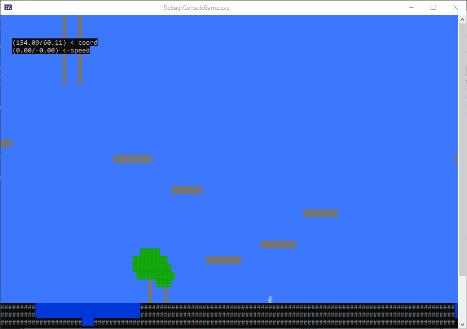

This is a VS Studio project.  

Main goal of this was to create a convenient way to load and use ASCII based game levels. Game uses physics-based movement, for the reasons unknown (It was sort of like pong a the start).   

